# RBTI: Research Behavior Type Indicator

  <a href="./assets/preview/teaser.pdf">
    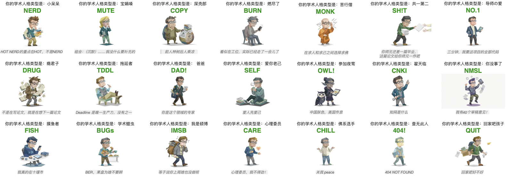
  </a>

  <strong>一个把科研人格、组会创伤、deadline 生存学和结果海报做成可传播测试的 public showcase。</strong>
   
  17 questions · 8 dimensions · 21 personas · KV-backed live stats

  <a href="https://www.research-mbti.com/">Live Demo</a>
  

  
  
  
  
  

## 项目介绍

RBTI 是一个把科研生活、组会创伤、deadline 文化和人格测试揉在一起的项目。它不是传统意义上的严肃量表，而是一个更适合研究生互联网语境的梗图型人格测试：一部分是科研人设观察，一部分是实验室日常切片，一部分是可直接转发的结果海报。

这个项目当前对外展示的核心结构有三层：

- 17 道题，8 个维度，快速完成答题
- 21 种科研人格结果，从 `DRUG` 到 `QUIT`
- 基于 Cloudflare KV 的实时聚合统计，让人格分布会随着更多人答题不断变化

这个 public repo 只保留面向访客的展示层：公开统计快照、人格图片和项目介绍。核心测评逻辑、生成脚本和内部工作文件不在这里展开。

<!-- LIVE_STATS:START -->
## Live Quiz Snapshot

<table>
<tr>
<td align="center" width="25%">
  <strong>Total Results</strong> 
  <code>1185</code>
</td>
<td align="center" width="25%">
  <strong>Top Persona</strong> 
  <code>TDDL</code> 拖延者 (14.9%)
</td>
<td align="center" width="25%">
  <strong>Active Types</strong> 
  <code>20 / 21</code>
</td>
<td align="center" width="25%">
  <strong>Last Sync</strong> 
  <code>2026-07-06 01:01 UTC+8</code>
</td>
</tr>
</table>

Live snapshot, auto-refreshed every 10 minutes.

**Top 5 Leaderboard**

| # | Type | Count | Share | Bar |
| --- | --- | ---: | ---: | --- |
| 1 | **TDDL** 拖延者 | 177 | 14.9% | `###.................` |
| 2 | **QUIT** 回家吧孩子 | 147 | 12.4% | `##..................` |
| 3 | **CHILL** 佛系选手 | 110 | 9.3% | `##..................` |
| 4 | **NO.1** 导师の爱 | 78 | 6.6% | `#...................` |
| 5 | **DRUG** 瘾君子 | 76 | 6.4% | `#...................` |

Full ranking snapshot

| # | Type | Count | Share | Bar |
| --- | --- | ---: | ---: | --- |
| 1 | TDDL 拖延者 | 177 | 14.9% | `###.................` |
| 2 | QUIT 回家吧孩子 | 147 | 12.4% | `##..................` |
| 3 | CHILL 佛系选手 | 110 | 9.3% | `##..................` |
| 4 | NO.1 导师の爱 | 78 | 6.6% | `#...................` |
| 5 | DRUG 瘾君子 | 76 | 6.4% | `#...................` |
| 6 | OWL! 参见夜莺 | 75 | 6.3% | `#...................` |
| 7 | BURN 燃尽了 | 73 | 6.2% | `#...................` |
| 8 | FISH 摸鱼者 | 70 | 5.9% | `#...................` |
| 9 | DAD! 爸爸 | 62 | 5.2% | `#...................` |
| 10 | SELF 爱你老己 | 62 | 5.2% | `#...................` |
| 11 | COPY 屎壳郎 | 53 | 4.5% | `#...................` |
| 12 | IMSB 我是硕博 | 52 | 4.4% | `#...................` |
| 13 | BUG-s 学术蝗虫 | 45 | 3.8% | `#...................` |
| 14 | MUTE 宝娟嗓 | 42 | 3.5% | `#...................` |
| 15 | MONK 苦行僧 | 36 | 3.0% | `#...................` |
| 16 | SH!T 共一第二 | 25 | 2.1% | `#...................` |
| 17 | NERD 小呆呆 | 22 | 1.9% | `#...................` |
| 18 | CNKI 翟天临 | 21 | 1.8% | `#...................` |
| 19 | NMSL 你没事了 | 8 | 0.7% | `#...................` |
| 20 | CARE 心理委员 | 6 | 0.5% | `#...................` |
| 21 | 404! 查无此人 | 0 | 0.0% | `....................` |

<!-- LIVE_STATS:END -->

## Full Persona Gallery

<table>
<tr>
<td align="center" width="33%">
  
   <strong>DRUG</strong> 瘾君子
</td>
<td align="center" width="33%">
  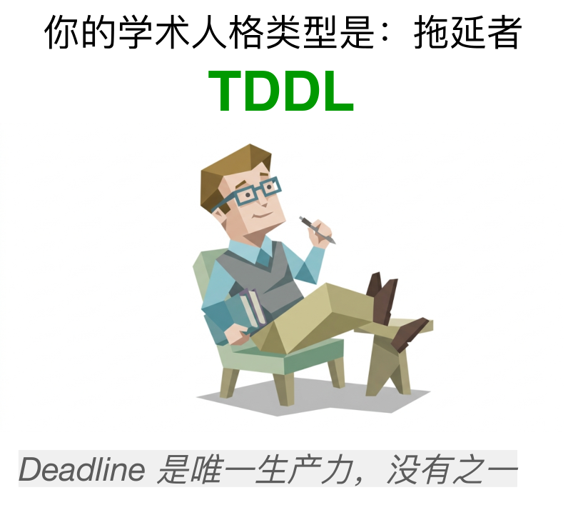
   <strong>TDDL</strong> 拖延者
</td>
<td align="center" width="33%">
  
   <strong>DAD!</strong> 爸爸
</td>
</tr>
<tr>
<td align="center" width="33%">
  
   <strong>NERD</strong> 小呆呆
</td>
<td align="center" width="33%">
  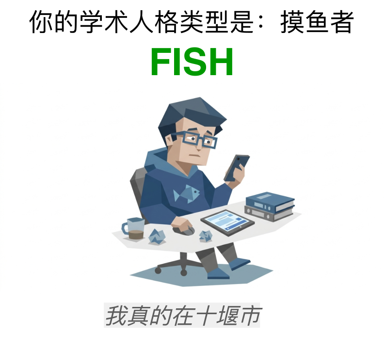
   <strong>FISH</strong> 摸鱼者
</td>
<td align="center" width="33%">
  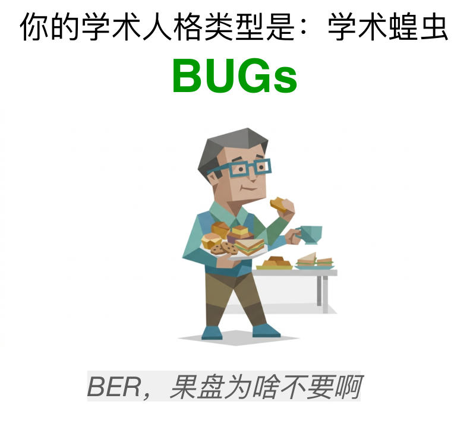
   <strong>BUG-s</strong> 学术蝗虫
</td>
</tr>
<tr>
<td align="center" width="33%">
  
   <strong>IMSB</strong> 我是硕博
</td>
<td align="center" width="33%">
  
   <strong>NO.1</strong> 导师の爱
</td>
<td align="center" width="33%">
  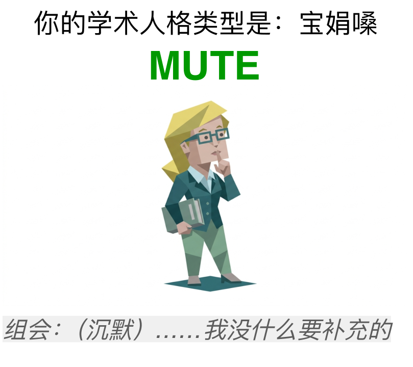
   <strong>MUTE</strong> 宝娟嗓
</td>
</tr>
<tr>
<td align="center" width="33%">
  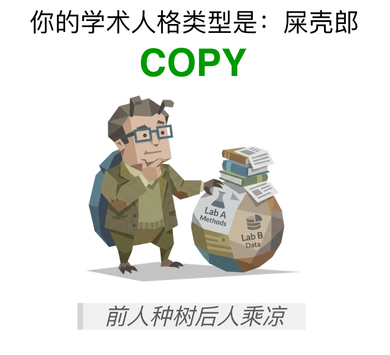
   <strong>COPY</strong> 屎壳郎
</td>
<td align="center" width="33%">
  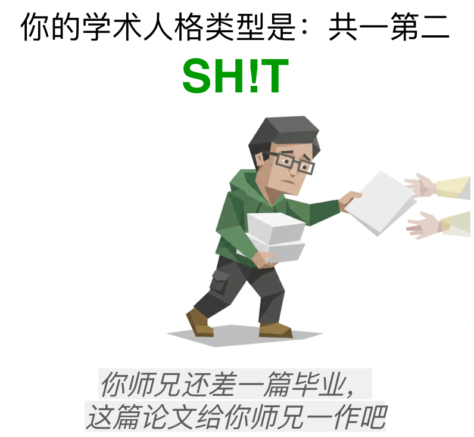
   <strong>SH!T</strong> 共一第二
</td>
<td align="center" width="33%">
  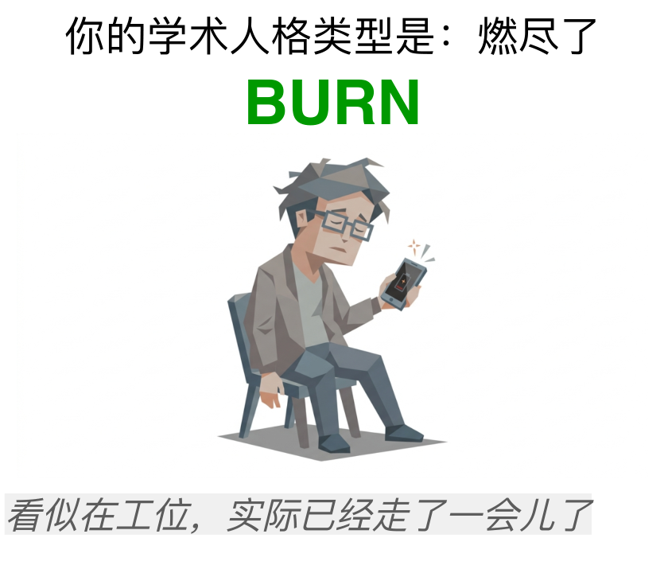
   <strong>BURN</strong> 燃尽了
</td>
</tr>
<tr>
<td align="center" width="33%">
  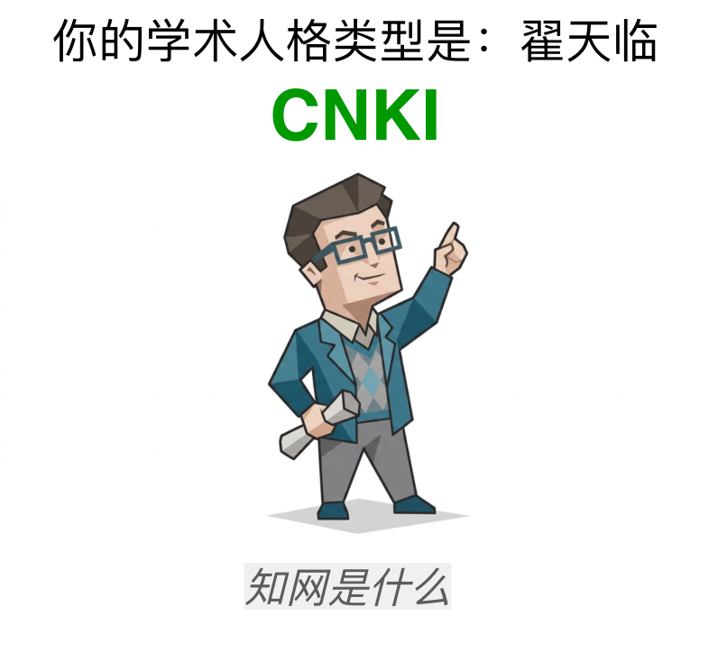
   <strong>CNKI</strong> 翟天临
</td>
<td align="center" width="33%">
  
   <strong>SELF</strong> 爱你老己
</td>
<td align="center" width="33%">
  
   <strong>CARE</strong> 心理委员
</td>
</tr>
<tr>
<td align="center" width="33%">
  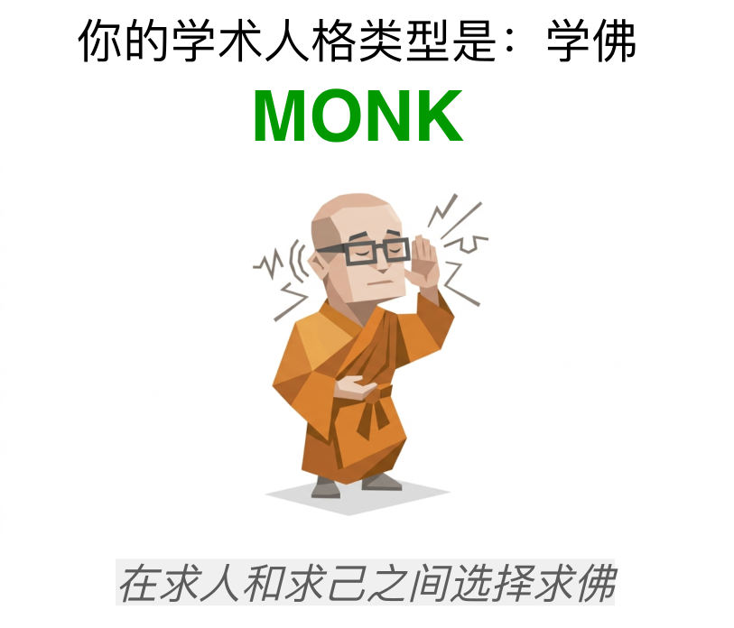
   <strong>MONK</strong> 苦行僧
</td>
<td align="center" width="33%">
  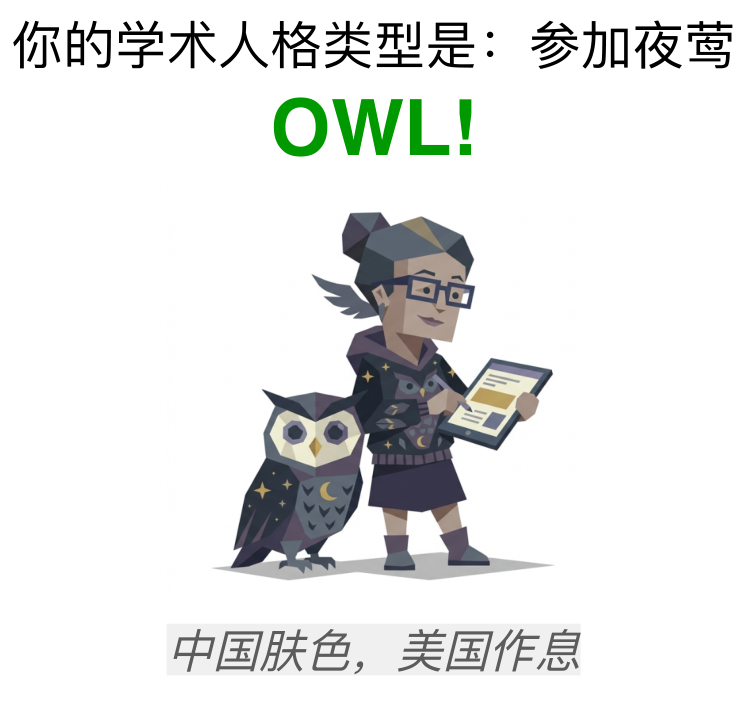
   <strong>OWL!</strong> 参见夜莺
</td>
<td align="center" width="33%">
  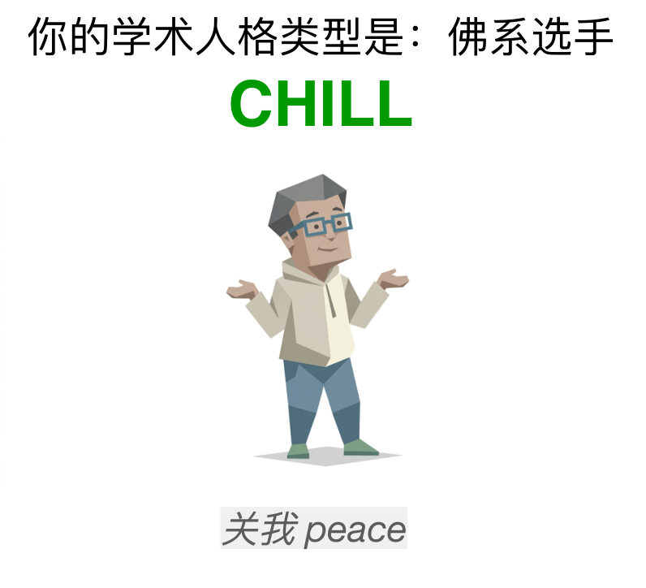
   <strong>CHILL</strong> 佛系选手
</td>
</tr>
<tr>
<td align="center" width="33%">
  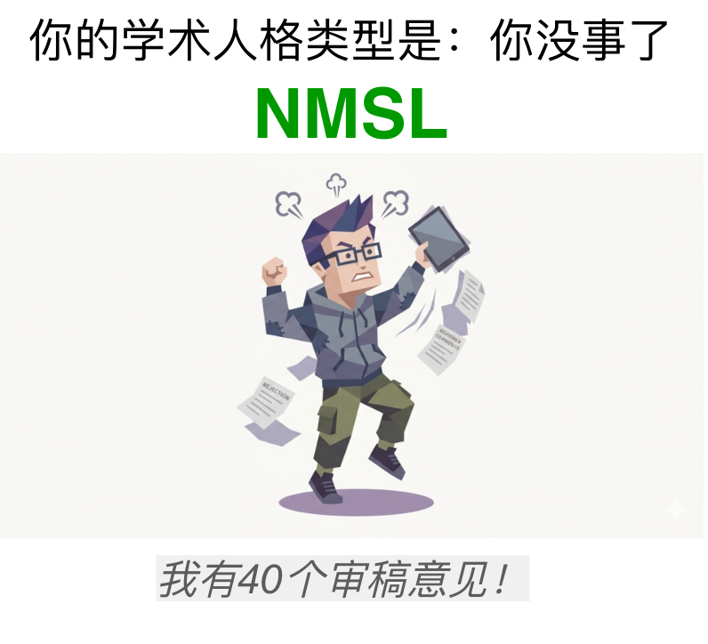
   <strong>NMSL</strong> 你没事了
</td>
<td align="center" width="33%">
  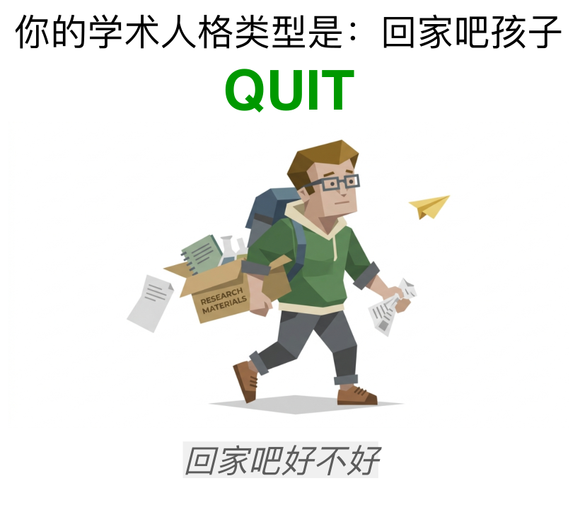
   <strong>QUIT</strong> 回家吧孩子
</td>
<td align="center" width="33%">
  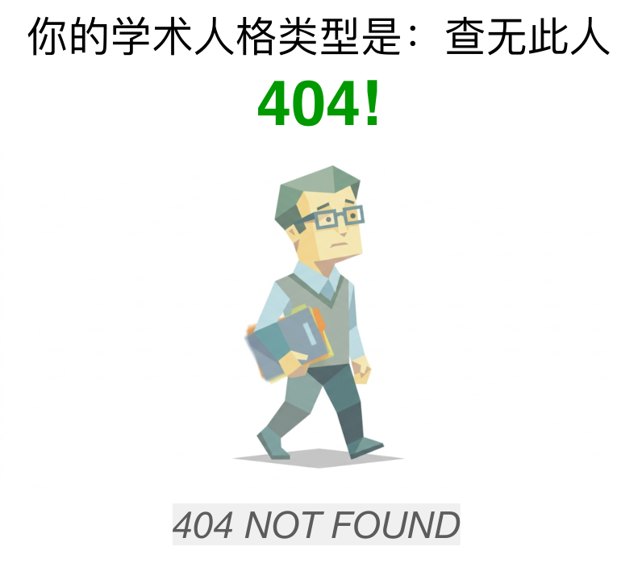
   <strong>404!</strong> 查无此人
</td>
</tr>
</table>

## Star History

## 备注 / Notes

- 这个项目主要用于娱乐、共鸣和传播，不用于任何严肃人格诊断。
- 如果你关心最新的人格分布，README 的同步脚本会持续从 live API 拉取最新数据。
