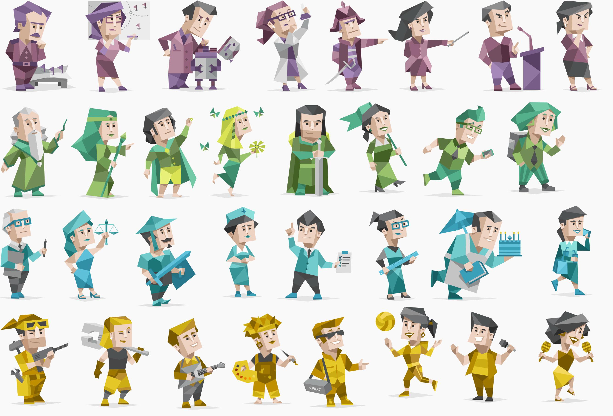

# RBTI: Research Behavior Type Indicator

  <strong>一个把科研人格、组会创伤、deadline 生存学和结果海报做成可传播测试的开源项目。</strong>
   
  17 questions · 8 dimensions · 21 personas · KV-backed live stats

  <a href="https://www.research-mbti.com/">Live Demo</a>
  ·
  <a href="https://www.research-mbti.com/">Take the Quiz</a>
  ·
  <a href="https://www.star-history.com/#HenryLau7/research-mbti&Date">Star History</a>

  
  
  
  
  

  

## 项目介绍 / What This Project Is

RBTI 是一个把科研生活、组会创伤、deadline 文化和人格测试揉在一起的项目。它不是传统意义上的严肃量表，而是一个更适合研究生互联网语境的梗图型人格测试：一部分是科研人设观察，一部分是实验室日常切片，一部分是可直接转发的结果海报。

这个项目当前对外展示的核心结构有三层：

- 17 道题，8 个维度，快速完成答题
- 21 种科研人格结果，从 `DRUG` 到 `QUIT`
- 基于 Cloudflare KV 的实时聚合统计，让人格分布会随着更多人答题不断变化

这个仓库是项目的 public showcase 版本。它的目标不是把所有实现细节堆出来，而是让 GitHub 首页本身就像一张项目 landing page：一屏内讲清楚项目是什么、为什么好玩、现在测出来的人格分布怎样、以及全部人格图长什么样。

## 为什么它容易传播 / Why It Gets Shared

- 它把真实的课题组行为压缩成了很短、很好记的人格标签
- 结果是视觉优先的，天然适合截图、转发和二创
- 文案写给真正经历过组会、返修、导师压力的人，所以会有共鸣
- 仓库首页本身就是一个会自动更新的项目主页，而不是静态代码坟场

## Live Quiz Snapshot

- Total quiz results: **12**
- Top type right now: **DRUG 瘾君子** (33.3%)
- Rarest non-zero type right now: **SELF 爱你老己** (8.3%)
- Data source: [`/api/stats`](https://www.research-mbti.com/api/stats)
- Last synced: **2026-04-11 23:28 UTC+8**

| # | Type | Count | Share | Bar |
| --- | --- | ---: | ---: | --- |
| 1 | DRUG 瘾君子 | 4 | 33.3% | `#######.............` |
| 2 | CHILL 佛系选手 | 3 | 25.0% | `#####...............` |
| 3 | QUIT 回家吧孩子 | 3 | 25.0% | `#####...............` |
| 4 | TDDL 拖延者 | 1 | 8.3% | `##..................` |
| 5 | SELF 爱你老己 | 1 | 8.3% | `##..................` |
| 6 | DAD! 爸爸 | 0 | 0.0% | `....................` |
| 7 | NERD 小呆呆 | 0 | 0.0% | `....................` |
| 8 | FISH 摸鱼者 | 0 | 0.0% | `....................` |
| 9 | BUG-s 学术蝗虫 | 0 | 0.0% | `....................` |
| 10 | IMSB 我是硕博 | 0 | 0.0% | `....................` |
| 11 | NO.1 导师の爱 | 0 | 0.0% | `....................` |
| 12 | MUTE 宝娟嗓 | 0 | 0.0% | `....................` |
| 13 | COPY 屎壳郎 | 0 | 0.0% | `....................` |
| 14 | SH!T 共一第二 | 0 | 0.0% | `....................` |
| 15 | BURN 燃尽了 | 0 | 0.0% | `....................` |
| 16 | CNKI 翟天临 | 0 | 0.0% | `....................` |
| 17 | CARE 心理委员 | 0 | 0.0% | `....................` |
| 18 | MONK 苦行僧 | 0 | 0.0% | `....................` |
| 19 | OWL! 参见夜莺 | 0 | 0.0% | `....................` |
| 20 | NMSL 你没事了 | 0 | 0.0% | `....................` |
| 21 | 404! 查无此人 | 0 | 0.0% | `....................` |

## 项目亮点 / Project Highlights

- **Meme-native framing**: 这个项目天然适合研究生社交媒体的表达方式
- **Live public snapshot**: README 里的分布统计直接从线上生产接口刷新
- **Poster-ready output**: 每个人格都对应一张适合分享的图片
- **Extensible system**: 同一套思路可以继续扩展到 ABTI、SBTI 等衍生版本

## Full Persona Gallery

<table>
<tr>
<td align="center" width="33%">
  
   <strong>DRUG</strong> 瘾君子
</td>
<td align="center" width="33%">
  
   <strong>TDDL</strong> 拖延者
</td>
<td align="center" width="33%">
  
   <strong>DAD!</strong> 爸爸
</td>
</tr>
<tr>
<td align="center" width="33%">
  
   <strong>NERD</strong> 小呆呆
</td>
<td align="center" width="33%">
  
   <strong>FISH</strong> 摸鱼者
</td>
<td align="center" width="33%">
  
   <strong>BUG-s</strong> 学术蝗虫
</td>
</tr>
<tr>
<td align="center" width="33%">
  
   <strong>IMSB</strong> 我是硕博
</td>
<td align="center" width="33%">
  
   <strong>NO.1</strong> 导师の爱
</td>
<td align="center" width="33%">
  
   <strong>MUTE</strong> 宝娟嗓
</td>
</tr>
<tr>
<td align="center" width="33%">
  
   <strong>COPY</strong> 屎壳郎
</td>
<td align="center" width="33%">
  
   <strong>SH!T</strong> 共一第二
</td>
<td align="center" width="33%">
  
   <strong>BURN</strong> 燃尽了
</td>
</tr>
<tr>
<td align="center" width="33%">
  
   <strong>CNKI</strong> 翟天临
</td>
<td align="center" width="33%">
  
   <strong>SELF</strong> 爱你老己
</td>
<td align="center" width="33%">
  
   <strong>CARE</strong> 心理委员
</td>
</tr>
<tr>
<td align="center" width="33%">
  
   <strong>MONK</strong> 苦行僧
</td>
<td align="center" width="33%">
  
   <strong>OWL!</strong> 参见夜莺
</td>
<td align="center" width="33%">
  
   <strong>CHILL</strong> 佛系选手
</td>
</tr>
<tr>
<td align="center" width="33%">
  
   <strong>NMSL</strong> 你没事了
</td>
<td align="center" width="33%">
  
   <strong>QUIT</strong> 回家吧孩子
</td>
<td align="center" width="33%">
  
   <strong>404!</strong> 查无此人
</td>
</tr>
</table>

## 仓库结构 / Repository Map

- `README.md`: 面向 GitHub 访客的生成版首页
- `README.template.md`: 手写文案模板
- `data/personas.json`: 本地人格元数据，供图库生成使用
- `data/stats-snapshot.json`: 最近一次同步下来的线上统计快照
- `assets/posters/`: README 使用的人格图素材
- `scripts/generate-readme.mjs`: 拉线上 stats 并重建 README 的脚本

## README 自动更新 / How The README Updates

1. 线上站点把聚合统计写进 Cloudflare KV。
2. 公开接口通过 `https://www.research-mbti.com/api/stats` 暴露这些统计。
3. 这个仓库会拉取该接口，更新本地 snapshot，并重新生成 `README.md`。
4. GitHub Actions 支持定时刷新，也支持手动触发。

## Star History / 仓库 Star 趋势

## 备注 / Notes

- 这个项目主要用于娱乐、共鸣和传播，不用于任何严肃人格诊断。
- 如果你关心最新的人格分布，README 的同步脚本会持续从 live API 拉取最新数据。
